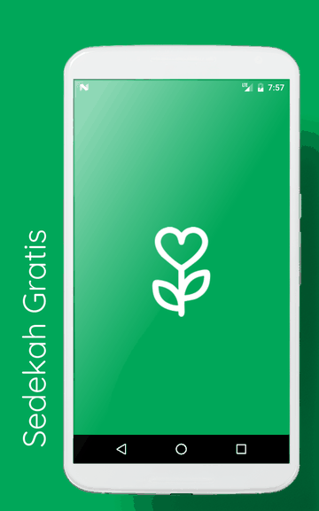
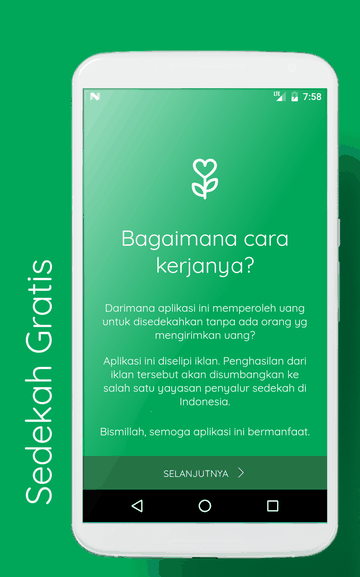
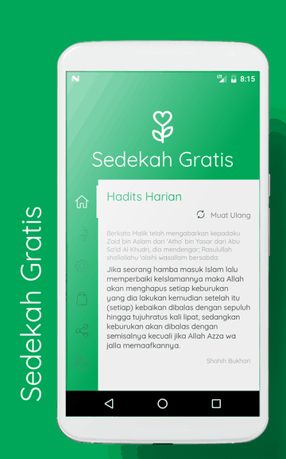
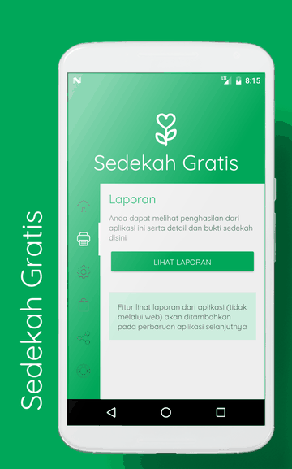
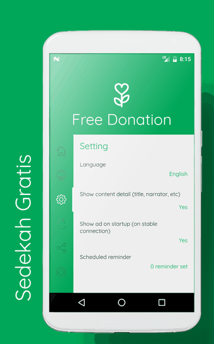
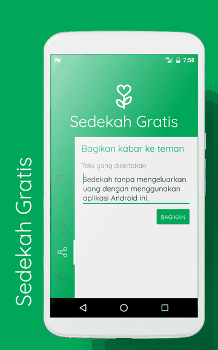
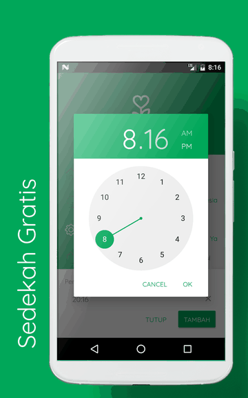

#  Free Donation (Sedekah Gratis)

An Android app that turns ad revenue into charity. Users read daily hadith content; the ads shown alongside it generate income, and that income is donated to an Indonesian charity foundation (*yayasan penyalur sedekah*). Users donate simply by using the app — no money leaves their pocket.

Donation reports and proof of distribution are published back to users inside the app.

**Package:** `com.koceeng.freedonation`

> [!NOTE]
> **This project now stands as a proof of concept only.** The published APK has been deactivated and the app is no longer distributed.
>
> It was initiated and developed at a time when ad provider policies were considerably less strict than they are today. Anyone reusing this code should check the current AdMob / Google Play policies before shipping anything built on the same model.

<details>
<summary><b>Screenshots</b> — click to expand</summary>
<br>








</details>


## Features

- **Daily Hadith feed** — content served from Firebase Realtime Database, cached locally in SQLite for offline reading
- **Scheduled reminders** — user-configurable alarms via `AlarmManager`, restored on device boot
- **Donation report** — link to public income/distribution reports
- **Bank account list** — donation accounts of the partner foundation
- **In-app changelog** — remote-driven, keyed by update code
- **FAQ / Help** — remote content
- **Multi-language** — English and Indonesian (`values/` + `values-in/`)
- **Remote kill switch** — `is-active` flag gates the app into `NotActiveActivity`
- **Forced update** — version check routes to `UpdateActivity`
- **In-app billing** — optional direct donation via Google Play Billing (v3 AIDL)

## Tech Stack

| Concern | Library |
|---|---|
| Backend | Firebase Realtime Database |
| Crash reporting | Firebase Crash |
| Ads | Firebase Ads (AdMob) |
| Local storage | SQLite (raw, via `SQLiteUtil`) |
| View binding | ButterKnife 8.5.1 |
| Events | EventBus 3.0.0 |
| Images | Glide 3.7.0 |
| Fonts | Calligraphy 2.1.0 |
| Permissions | EasyPermissions 0.2.0 |
| Transitions | CircularReveal 2.0.1 |
| UI | Android Support Library 25.1.0 (AppCompat, Design, CardView) |

**minSdk** 17 · **targetSdk / compileSdk** 25 · **Java**

## Project Structure

```
app/src/main/java/com/koceeng/freedonation/
├── alarm/       Scheduled reminders — AlarmManager, receiver, notification service
├── bank/        Donation bank account list
├── base/        App, BaseActivity, BaseBottomSheet, Firebase base object
├── billing/     Google Play Billing v3 (IabHelper and friends)
├── changelog/   Remote changelog
├── help/        FAQ
├── helper/      Device UID, feed, layout switcher, permissions
├── home/        Splash, Home, NotActive
├── impression/  First-run explainer ("how does this work?")
├── object/      Content, HomeMenu, VersionData models
├── setting/     Language picker, settings persistence
├── sqlite/      SQLite init + query helpers
├── update/      Forced-update screen
└── util/        Ads, app, data paths, debug, intents, language, layout, prefs
```

### Firebase Data Paths

Defined centrally in `util/DataPathUtil.java`:

| Path | Purpose |
|---|---|
| `is-active` | Remote kill switch |
| `/content/{lang}/last` | Latest content pointer |
| `/content/{lang}/data/{id}` | Content by id |
| `/faq/{lang}` | FAQ entries |
| `changelog` · `changelog/updatecode` | Changelog + version gate |
| `bank-account-number` | Donation accounts |
| `report-link` | Link to donation report |

## Build

```bash
git clone <repo-url>
cd freedonation
./gradlew assembleDebug
```

You must supply your own Firebase config — `app/google-services.json` is tied to a specific Firebase project:

1. Create a Firebase project and register the package `com.koceeng.freedonation` (and `com.koceeng.freedonation.debug`).
2. Enable Realtime Database and set read rules for the paths above.
3. Download `google-services.json` into `app/`.
4. Replace the AdMob unit IDs in `app/src/main/res/values/ad_keys.xml` with your own.

### Build Variants

| Variant | applicationId suffix | Minify | Debuggable |
|---|---|---|---|
| `debug` | `.debug` | no | yes |
| `experimental` | `.debug` | yes | yes |
| `release` | — | yes | no |

Release and experimental builds copy their ProGuard mapping file into `proguardTools/` after assembly.

### Signing

No signing config is committed. Create your own keystore and supply credentials outside version control — `~/.gradle/gradle.properties` or an ignored `keystore.properties`. Never commit `.jks` files.

## Permissions

| Permission | Why |
|---|---|
| `INTERNET`, `ACCESS_NETWORK_STATE` | Firebase content + ads |
| `RECEIVE_BOOT_COMPLETED` | Re-arm reminders after reboot |
| `GET_TASKS` | Foreground-state check (deprecated API) |
| `com.android.vending.BILLING` | Optional in-app donation |

## Status

**Proof of concept — not a live app.** The released APK has been deactivated and the project is archived as-is at v1.0.0. The code is published for reference: how the ad-revenue-to-charity flow was wired up, and how the remote-controlled content, kill switch, and update gate worked.

Two reasons it isn't a template to ship from directly:

- **Policy.** It was built when ad provider policies were far looser than they are now. Donating ad revenue, ad placement density, and incentivized-viewing patterns are all governed by rules that have tightened considerably since. Verify current AdMob and Google Play policy before reusing the model.
- **Dependencies.** Built against the Android Support Library and Firebase 9.8.0 — both predate AndroidX and the Firebase BoM. Expect a full dependency modernization pass.

## License

MIT — see [LICENSE](LICENSE).

Note: the license covers the source code only. The app name, icon, branding, and the Firebase/AdMob accounts it points at are not granted.
